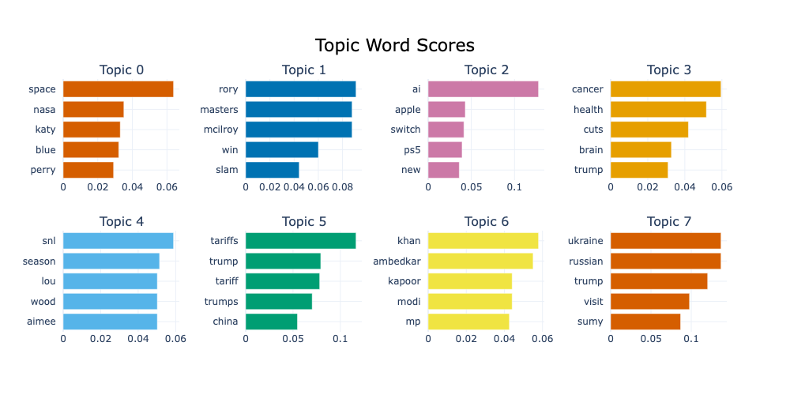
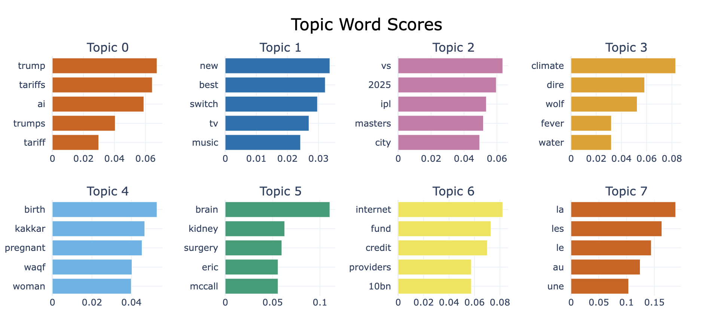

<h1 align="center">RSS Scraper</h1>
<p align="center">Sidharrth Nagappan</p>
<p align="center">
  
  
  
</p>

---

## Core Functions

This tool presents a complete pipeline for analyzing RSS feeds. It parses a PDF to extract RSS URLs, retrieves and cleans article titles, performs data sanity checks, and stores the processed results. The tool supports multi-threaded scraping for efficiency and applies topic modeling (via BERTopic) to identify clusters across news headlines.

## How to Run

Set up your environment:
```bash
conda create -n rss_scraper python=3.9
conda activate rss_scraper
pip install -r requirements.txt
```

Run the scraper:
```bash
python app.py
```

Run tests:
```bash
pytest tests.py
```

Artifacts, such as downloaded JSON files, topic distribution files and topic modelling plots can be found in `artifacts/` by default.

## Questions

### (3a) What is a unit test? Write a pseudo-code for a unit-test for the rss feed scraper (just rough, doesn’t need to be super deep). Think about the library you’re using, the naming conventions, and also ease of use/speed

A unit test verifies individual and isolated core functionality in a codebase, making sure it works as expected independently. This verification is often done by comparing the functionality's output with our expectations for it. For instance, when verifying the functionality of RSS parsing, we can pass in a rough RSS string and verify if the extracted titles match our pre-defined list. 

I defined a full test suite in `tests.py` for the PDF download step, URL extraction and 2 difficulties of RSS parsing. 

Here is quick pseudo-code for the RSS parsing + cleaning unit tests:

Basic Test:
```
1. Patch `requests.get` to avoid the actual HTTP calls.
2. Create a mock response to simulate a valid RSS feed.
3. Inject mock response into scraper
4. Call my `verify_and_extract_titles` using a fake URL and the mock response.
5. Assert that the output's length and content match the expected values.
```

Complex RSS Parsing Test (Preprocessing Robustness)
```
1. Create a second mock response to simulate a messier RSS feed, that has nested tags, and special characters.
2. Inject more complex mock response into scraper
3. Call my `verify_and_extract_titles` using a fake URL and the mock response.
4. Assert that the output's length and content match the expected values, especially whether the special characters were correctly parsed and the output is exactly discernible post-processing.
```

<!-- I would run it across two complexities of RSS feeds, one that has a simple structure, and one that's more complex with special characters, nesting etc. If the first complexity level fails, it immediately shows that core parsing itself is broken. If the second fails, one should look deeper into the pre-processing and cleaning steps. -->

Together, these tests catch both structural parsing issues (e.g. incorrect XML handling) and semantic cleaning issues (e.g. inconsistently encoded characters, missing titles).
The basic test ensures the core works, while the complex one stress-tests edge cases in real-world feeds.

### (3b) What data checks can you do upon first extraction to ensure your data is sane? What do 2 of these checks look like?

1. Check that the length of the title is of reasonable length. Often parsers can cut-off strings, resulting in single-world titles. While there can be single-word titles, the distribution of this data shows that it is not common.

2. Per-feed checks - If some fields pass the pre-processing step (which checks that the website indeed leads to XML data), but returned only 1 title or none at all, it's probably worth looking into, as that link might have malformed data. Titles shouldn't be near-identical as well.

> Refer to the full code in the `run_data_check()` method in `app.py`.

### (3c) What are the limitations of the data that you have extracted? Are there any glaring biases upon first glance?

**⚠️ Technical Issues**:
- It's a 2016 list of RSS feeds, so most of the links are dead and end up failing my first check, that verifies if the link actually leads to RSS data. Here's the exact breakdown of URL validity:
    ```
    INFO:root:Total valid URLs: 336
    INFO:root:Total URLs processed: 884
    INFO:root:Percentage of valid URLs: 38.01%
    ```
    Since only 38% of the URLs are valid, many links in the PDF are actually unused. 

**⚠️ Semantic Issues**

- Similar headlines appear in most RSS feeds. They are similar enough to be identified by the human eye, but not similar that they can be computationally de-duplicated. For instance, Trump's smartphone tariffs make an appearance multiple times with different title variations. 

- Several outlets like the New York Times have multiple RSS feeds, and the same article appears in several feeds, such as Trump's tariffs appearing in "Business", "International Business" and "Technology". This can give a false impression of diversity.

- We've only extracted the first 5 titles in each website, which does not lead to a sufficiently large dataset to draw conclusions from.
  
- The title on it's own often has limited context. For instance, the Economist has vague titles like *Current concern* and *Changing direction* that tell close to nothing about the articles themselves. 


### (3d) What stats/ML models can you use to extract information from the titles?

Since the feeds return data around a similar time range, one can quickly visualise the common "topics" across the extracted titles using topic modelling. I implemented rudimentary topic modelling using [BERTopic](https://maartengr.github.io/BERTopic/index.html).

Other forms of textual analysis include:

1. Keyword extraction - either through TF-IDF
2. Sentiment analysis - group titles into different tones / sentiments
3. Named Entity Recognition (NER) - news items often have a subject that they refer to / are centered around. NER can identify the main entities discussed in the day's news.

## General Topic Modelling

We can visualise topics generated using [BERTopic](https://maartengr.github.io/BERTopic/index.html) based on the extracted titles after removing stop words and clustering based on BERT embeddings. 

Notice the general topics are:
- Entertainment
- Golf
- Technology
- Healthcare
- Indian Politics
- Ukraine



When I ran this tool on Friday, a similar distribution is visible: 

- Trump
- Technology News
- Medical News
- Climate
- Sports
- IPL
- Random group of French words (since we didn't translate French -> English).



## Other Features of This Tool

1. I implementated multi-threading to speed up the scraping + parsing process, 
2. 4 tests are available in `tests.py`, which test the core functionality of the tool. It can be run using `pytest tests.py`.
3. Post-pipeline data sanity checks are implemented
